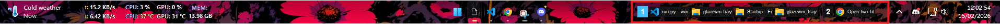
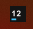
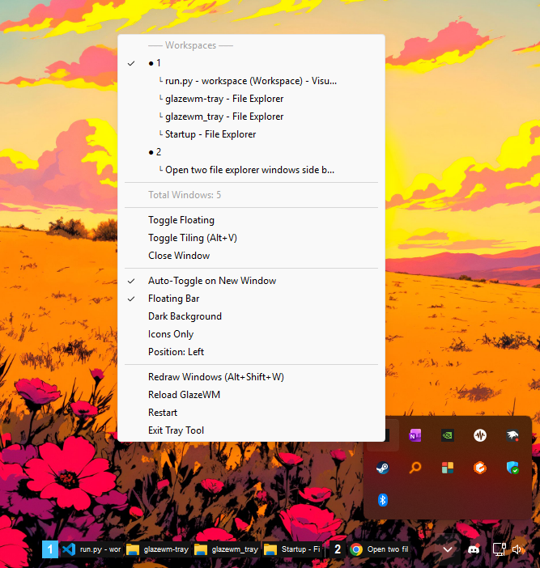

# 🪟 GlazeWM Tray Indicator

A lightweight, minimal system tray utility for GlazeWM. This tool replaces the need for a bulky status bar by providing workspace information and window management directly from the Windows System Tray.

## 📸 Example

**Floating bar on the taskbar** 


**Tray icon**  
 

**Right-click menu**  


## ✨ Features

### Display Modes (both enabled by default)
* **Floating Bar**: A wider bar that sits on the taskbar (left of the system tray) showing workspace numbers with real app icons for each window. Click any workspace to switch to it. Auto-hides during fullscreen apps (games, videos, etc.) but stays visible during "Show Desktop" (Win+D). Semi-transparent by default — toggle between transparent and opaque dark background from the tray right-click menu.
* **Tray Icon**: Compact system tray icon showing up to 3 workspace numbers with a blue underline on the focused one. Right-click for full workspace menu with window titles.

### Core Functionality
* **Multi-Workspace View**: Displays numbers for all workspaces currently containing open windows
* **Window List per Workspace**: Shows window app icons (floating bar) or titles (tray menu) under each workspace
* **Focus Tracking**: Highlights your active workspace with blue
* **Occupancy Indicators**: Workspaces with windows are marked with `●`, empty ones with `○`
* **Event-Driven Updates**: Focus and workspace events refresh instantly via WebSocket; burst events (window open/close) debounce briefly to avoid conflicts. Zero CPU when idle
* **Window Counter**: Displays total number of open windows across all workspaces

### Window Management
* **Auto-Toggle Tiling** ⭐ NEW: Automatically toggles tiling direction (vertical/horizontal) whenever a new window is opened
* **Quick Actions**: Right-click to access common window commands:
  - Toggle Floating mode
  - Toggle Tiling Direction (Alt+V equivalent)
  - Close active window
  - Reload GlazeWM configuration
* **Click-to-Switch**: Instantly jump to any workspace by clicking its number

### Reliability Features
* **Thread-Safe Operations**: Prevents race conditions and UI freezes
* **Error Recovery**: Automatic WebSocket reconnection if GlazeWM becomes unresponsive
* **Visual Error Indicators**: Icon changes to "!" when connection issues occur
* **Debounced Queries**: Waits for events to settle before querying, avoiding conflicts during window creation/destruction
* **Unfocusable Window**: Prevents the hidden pystray window from stealing focus from GlazeWM

## 📁 Project Structure

```
glazewm-tray/
├── config.py                  # ← User settings (colors, URL, toggles) — edit this file
├── run.py                     # ← Entry point: python run.py (rename to .pyw for silent mode)
├── glazewm_tray/              # Internal package (no need to edit)
│   ├── __init__.py
│   ├── app.py                 # Main application class
│   ├── floating_bar.py        # Taskbar floating bar widget
│   ├── icons.py               # Win32 app icon extraction
│   └── win32.py               # Win32 API constants and helpers
└── README.md
```

## 🛠️ Prerequisites

This tool requires **Python 3.x**. Open your terminal and run the following command to install the necessary libraries:

```bash
pip install pystray pillow websocket-client
```

## 🏃 How to Run

### 1. The Regular Way (For Testing)
Run the script using the standard Python command. This will keep a command prompt window open, which is helpful for seeing status messages and error logs:

```bash
python run.py
```

You'll see console output like:
```
Starting GlazeWM tray application...
Auto-toggle tiling: enabled
Connected to GlazeWM event stream (WebSocket)
```

### 2. The "Silent" Way (Background Mode)
To run the tool without a command prompt window cluttering your taskbar:

1. Rename `run.py` to `run.pyw`
2. Double-click the `.pyw` file
3. The script will now run invisibly in the background, appearing only as an icon in your System Tray

### 3. How to Stop the Tool
* **If running as .py**: Close the command prompt window or press `Ctrl+C`
* **If running as .pyw**: Right-click the icon in the System Tray and select **Exit Tray Tool**

## ⚙️ Start Automatically with Windows

To have your tray indicator start every time you log in:

1. Press `Win + R`, type `shell:startup`, and press Enter
2. Right-click your `run.pyw` file and select **Create Shortcut**
3. Move that shortcut into the Startup folder you just opened

**Pro Tip**: Use the `.pyw` version for startup to avoid having a command window appear on boot.

## 🎛️ Configuration

All settings live in `config.py` at the project root. This is the **only file you need to edit**.

### Display Mode
Both the floating bar and tray icon are enabled by default. You can disable either one:

```python
USE_FLOATING_BAR = True  # Set False to disable the floating bar on the taskbar
USE_TRAY_ICON = True     # Set False to disable the system tray icon
BAR_BG_COLOR = None      # None = transparent background, or set to (r, g, b) e.g. (20, 20, 20)
```

### Auto-Toggle Tiling Feature
The auto-toggle feature automatically runs the tiling direction toggle command (equivalent to Alt+V) whenever a new window is detected. This helps maintain optimal layouts as you open new applications.

**To disable auto-toggle**:
1. Set `AUTO_TOGGLE_TILING = False` in `config.py`, OR
2. Right-click the tray icon → Uncheck "Auto-Toggle on New Window"

You can toggle this setting on/off at any time without restarting the application.

### Debounce Delay
Focus and workspace events refresh instantly. Burst events (window open/close) debounce briefly to avoid hitting GlazeWM during critical moments. Default is 0.3 seconds:

```python
QUERY_DEBOUNCE = 0.3  # Seconds to wait after burst events (window managed/unmanaged) before querying
```

### WebSocket URL
If GlazeWM is running on a non-default port, change the URL in `config.py`:

```python
GLAZEWM_WS_URL = "ws://127.0.0.1:6123"
```

### Visual Customization
You can adjust the appearance by editing the `COLORS` dictionary in `config.py`:

```python
COLORS = {
    "bg": (20, 20, 20),          # Background color of the icon
    "text": (255, 255, 255),      # Color of workspace numbers
    "active": (66, 192, 251),     # Highlight color for focused workspace
    "inactive": (100, 100, 100),  # Color for empty workspaces
    "error": (255, 100, 100)      # Color for error indicator
}
```

## 📋 Menu Options

Right-click the tray icon to access:

| Option | Description |
|--------|-------------|
| **Workspace List** | Click any workspace to switch to it instantly |
| **Total Windows** | Shows count of all open windows |
| **Toggle Floating** | Toggle floating mode for active window |
| **Toggle Tiling (Alt+V)** | Manually toggle tiling direction |
| **Close Window** | Close the currently focused window |
| **Auto-Toggle on New Window** | Enable/disable automatic tiling toggle |
| **Floating Bar** | Toggle the floating bar visibility on/off |
| **Dark Background** | Switch between semi-transparent and fully opaque dark background |
| **Icons Only** | Hide process name text, show only app icons (compact mode) |
| **Position: Left** | Toggle bar between left side and right side (near tray) of taskbar |
| **Redraw Windows** | Redraw all managed windows |
| **Reload GlazeWM** | Reload GlazeWM configuration |
| **Restart** | Restart the tray tool (spawns new instance and exits current) |
| **Exit Tray Tool** | Close the tray application |

## ⚠️ Troubleshooting

### Icon shows "!"
The script cannot communicate with GlazeWM via WebSocket. Possible causes:
* GlazeWM is not running
* GlazeWM's WebSocket server is not listening on port 6123
* GlazeWM is temporarily unresponsive

**Fix**: Make sure GlazeWM is installed and running. The tool connects via `ws://127.0.0.1:6123`.

### Icon shows "?"
The script is running, but GlazeWM is not reporting any active monitors or workspaces.

**Fix**: Try reloading GlazeWM configuration using the tray menu option.

### Import Errors
If Python says "No module named pystray," re-run the pip install command specifically for your Python version:

```bash
python -m pip install pystray pillow websocket-client
```

### Windows Not Being Tracked
If new windows aren't being detected:
1. Check the console output (run as `.py` instead of `.pyw`)
2. Verify GlazeWM is properly managing the windows
3. Try toggling the Auto-Toggle feature off and on

### Logging for Debugging
To see detailed logs, run the script as `.py` (not `.pyw`) and check the console output. You'll see:
* Connection status messages
* Window count changes
* Auto-toggle actions
* Error messages with details

## 🤝 Contributing

Feel free to submit issues or pull requests if you find bugs or have feature suggestions!

## 📄 License

This is free and open-source software. Use it however you'd like!

## 🙏 Credits

Built for the [GlazeWM](https://github.com/glzr-io/glazewm) tiling window manager community.
